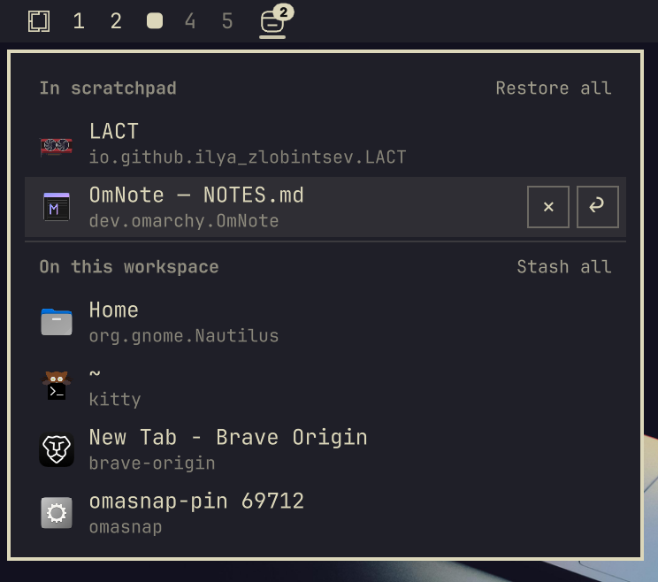

# Stashpad

An Omarchy bar widget for Hyprland special workspaces (the scratchpad).



- A drawn window icon, **dimmed** when the scratchpad is empty and **highlighted** while it is shown
- A **count badge** on the icon corner showing how many windows are inside. It turns the urgent colour when a stashed window wants attention while the scratchpad is hidden
- A **right-click menu** listing the windows in the scratchpad and the windows on the current workspace

## Mouse actions

| Action       | Effect                                                    |
|--------------|-----------------------------------------------------------|
| Left click   | Toggle the scratchpad                                     |
| Middle click | Stash the focused window                                  |
| Right click  | Open the menu                                             |

## Menu

Each row shows the app icon, the window title and its class. Titles use the full row width until you hover it.

- **Click the row** to focus the window. For a stashed window this also reveals its scratchpad.
- **`+` / `↩`** sends the window to the scratchpad, or brings it back to the current workspace. The `+`, `↩` and `×` buttons only appear while you hover a row.
- **`×`** closes the window.
- A dot on the icon marks a window that is asking for attention.
- **Restore all** brings every stashed window back to the current workspace. **Stash all** sends every window on the current workspace to the scratchpad. Each appears when there are two or more windows.

## Requirements

- Omarchy with the shell plugin system (`omarchy plugin`)
- Hyprland with the Lua config API (`hl.dsp.*`), which Omarchy ships

Stashpad only runs `hyprctl dispatch_lua_expression` to move, focus and close windows and to toggle the special workspace. It makes no network requests, installs nothing and needs no extra privileges.

## Install

```bash
omarchy plugin add https://github.com/imranZERO/omarchy-stashpad.git --enable
```

`--enable` adds the widget to your bar. To place it in a specific section:

```bash
omarchy bar move imranzero.stashpad --section right
```

To install by hand instead, clone the repository into a folder named after the plugin id, then enable it:

```bash
git clone https://github.com/imranZERO/omarchy-stashpad.git ~/.config/omarchy/plugins/imranzero.stashpad
omarchy plugin enable imranzero.stashpad
```

Update with `omarchy plugin update imranzero.stashpad`.

## Settings

Put settings on the layout entry itself:

| Key             | Default        | Description                                  |
|-----------------|----------------|----------------------------------------------|
| `workspace`     | `"scratchpad"` | Special workspace name (without `special:`)  |
| `showCount`     | `true`         | Show the count badge   |
| `hideWhenEmpty` | `false`        | Hide the widget completely when empty        |
| `activeColor`   | theme accent   | Colour used while the scratchpad is shown    |

You can add the widget more than once, one per special workspace:

```json
{ "id": "imranzero.stashpad" },
{ "id": "imranzero.stashpad", "workspace": "music", "hideWhenEmpty": true }
```

## Remove

```bash
omarchy plugin remove imranzero.stashpad
```

To remove it by hand, delete its entry from `bar.layout` in `~/.config/omarchy/shell.json` and delete `~/.config/omarchy/plugins/imranzero.stashpad`.

## License

MIT
